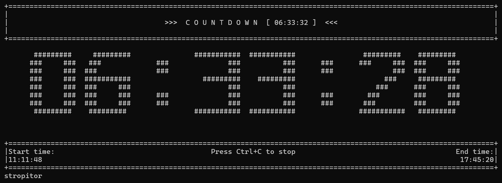

# wincountdown

A command-line countdown timer and clock for Linux with large ASCII art display, customizable audio alerts, and advanced functionality.



## Features

- **Large ASCII Art Display** - Customizable 8-line tall digits for maximum visibility
- **Flexible Time Input** - Support for multiple formats: `5m30s`, `1h30m`, `HH:MM:SS`, etc.
- **Audio Alerts** - Configurable beeps with adjustable frequency, duration, count, and gaps
- **Clock Mode** - Display current system time with ASCII art
- **Loop Mode** - Auto-restart countdown when finished
- **Metric Time Mode** - Fun base-100 time display
- **XDG Compliant** - Follows Linux standards for config and cache files
- **Highly Configurable** - JSON config file with detailed comments

## Installation

### Arch Linux (AUR)

**Coming soon!** Once published to AUR:

```bash
yay -S wincountdown
# or
paru -S wincountdown
```

### Manual Installation (Any Linux)

#### Using pip

```bash
git clone https://github.com/Stropitor/wincountdown-linux.git
cd wincountdown-linux
pip install .
```

#### Using setup.py

```bash
git clone https://github.com/Stropitor/wincountdown-linux.git
cd wincountdown-linux
python setup.py install
```

#### Standalone Script

```bash
git clone https://github.com/Stropitor/wincountdown-linux.git
cd wincountdown-linux
chmod +x wincountdown.py
# Run directly
./wincountdown.py 5m
# Or create a symlink
sudo ln -s "$(pwd)/wincountdown.py" /usr/local/bin/wincountdown
```

### Optional Dependencies

For enhanced audio alerts with customizable frequency and duration:

```bash
# Arch Linux
sudo pacman -S beep

# Debian/Ubuntu
sudo apt install beep

# Fedora
sudo dnf install beep
```

**Note:** Without `beep` package, the program will fall back to terminal bell (`\a`) character.

## Usage

### Basic Examples

```bash
# 5 minute countdown
wincountdown 5m

# 30 second countdown
wincountdown 30s

# 1 hour 30 minutes
wincountdown 1h30m

# Using colon notation
wincountdown 01:30:00

# Clock mode
wincountdown --clock
```

### Advanced Examples

```bash
# Silent countdown (no beep)
wincountdown 10m -s

# Loop mode (auto-restart)
wincountdown 25m -l

# Custom beep settings
wincountdown 5m -f 1000 -b 5 -d 500 -g 200

# Metric time mode
wincountdown 10m -m

# Combine options
wincountdown 1h -l -f 800 -b 3
```

### Command-Line Options

```
positional arguments:
  time                  Time in format: 5m, 30s, 1h30m, or HH:MM:SS

optional arguments:
  -h, --help            Show help message
  -s, --silent          Disable beep alert
  -l, --loop            Loop countdown (restart when finished)
  -m, --metric          Display in metric time (base-100)
  -f HZ                 Beep frequency in Hz (37-32767, default: 800)
  -b COUNT              Number of beeps (1-100, default: 3)
  -d MS                 Beep duration in milliseconds (default: 1000)
  -g MS                 Gap between beeps in milliseconds (default: 300)
  -c, --clock           Clock mode (display current time)
  --debug               Enable debug logging
```

## Configuration

Configuration file is automatically created on first run at:
```
~/.config/wincountdown/config.json
```

Debug logs (when enabled) are written to:
```
~/.cache/wincountdown/debug.log
```

### Configuration Options

The config file allows you to customize:
- **Default beep settings** (frequency, count, duration, gaps)
- **Default modes** (silent, loop, metric)
- **ASCII art digits** (customize the appearance of 0-9 and colon)
- **No-args behavior** (custom command when run without arguments)
- **Time-only defaults** (auto-inject flags when only time is provided)
- **Debug mode** (enable detailed logging)

Example config snippet:

```json
{
    "debug_mode": false,
    "default_frequency": 800,
    "default_beep_count": 3,
    "default_duration": 1000,
    "default_gap": 300,
    "default_silent": false,
    "default_loop": false,
    "default_metric": false
}
```

## Time Formats

The timer supports various input formats:

- **Seconds only**: `30s`, `500s`
- **Minutes only**: `5m`, `45m`
- **Hours only**: `2h`, `10h`
- **Combined**: `1h30m`, `2h15m30s`, `45m30s`
- **Colon notation**: `HH:MM:SS` or `MM:SS`

## Metric Time Mode

A fun "joke mode" using base-100 time:
- 1 metric hour = 100 metric minutes
- 1 metric minute = 100 metric seconds
- Input time is real time; display shows metric equivalent

## Development

### Project Structure

```
wincountdown-linux/
├── wincountdown.py          # Main application (single file)
├── setup.py                 # Python packaging
├── LICENSE                  # GNU GPLv3
├── README.md                # This file
├── .gitignore               # Git ignore rules
│
├── docs/                    # Documentation
│   ├── INSTALL.md           # Installation & testing guide
│   ├── PORTING_NOTES.md     # Windows→Linux porting details
│   └── CODEBASE_OVERVIEW.md # Complete code documentation
│
├── packaging/               # Distribution packages
│   ├── arch/                # Arch Linux AUR
│   │   ├── PKGBUILD         # AUR package build script
│   │   └── .SRCINFO         # AUR metadata
│   └── examples/            # Example configurations
│       └── wincountdown-config.json
│
└── screenshots/             # Example screenshots
    └── screenshot_1.png
```

### Additional Documentation

For more detailed information, see:
- **[Installation Guide](docs/INSTALL.md)** - Detailed installation instructions and troubleshooting
- **[Codebase Overview](docs/CODEBASE_OVERVIEW.md)** - Complete code documentation and architecture
- **[Porting Notes](docs/PORTING_NOTES.md)** - Details about the Windows→Linux port

### Contributing

Contributions are welcome! Please feel free to submit issues or pull requests.

## License

GNU General Public License v3.0 - see [LICENSE](LICENSE) file for details.

## Credits

Created by stropitor

## FAQ

**Q: Why is it called "wincountdown" if it's for Linux?**
A: The name is based on "winner," not Windows. The Linux version is a port of the original Windows tool.

**Q: The beep sound doesn't work!**
A: Install the `beep` package for your distribution. Without it, the program falls back to the terminal bell character which may be disabled in your terminal emulator.

**Q: Can I customize the ASCII art digits?**
A: Yes! Edit `~/.config/wincountdown/config.json` and modify the `ascii_digits` section. Each digit must be exactly 8 lines tall and 11 characters wide.

**Q: How do I reset to default configuration?**
A: Delete `~/.config/wincountdown/config.json` and the program will recreate it with defaults on next run.

## Related Projects

- [wincountdown](https://github.com/Stropitor/wincountdown-windows) - Original Windows version
